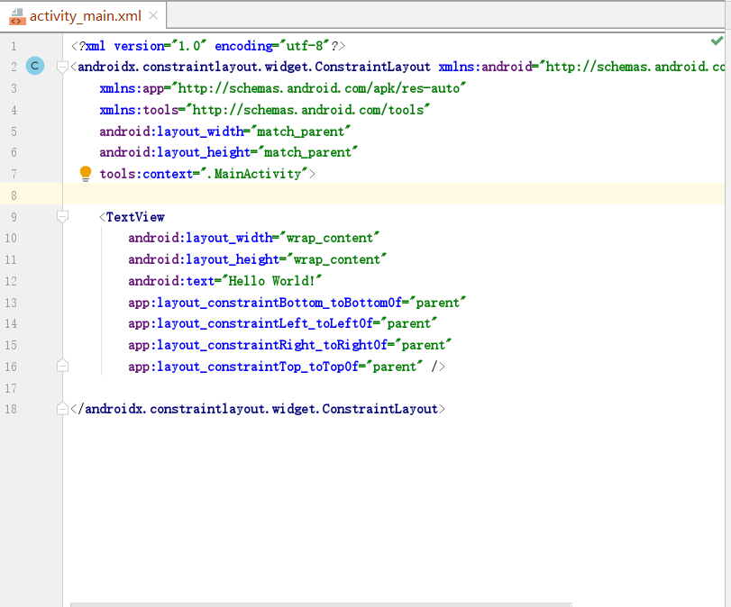
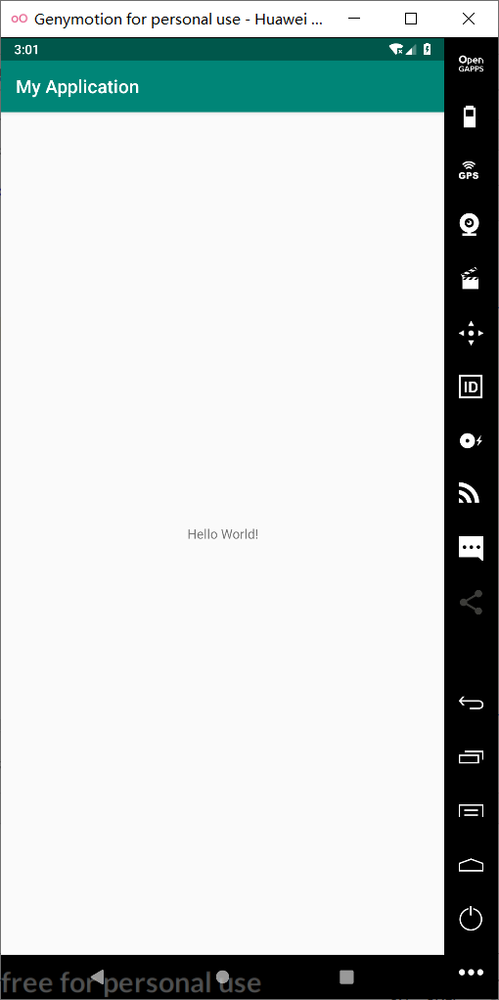

# 安装Android Studio

## 1.Android Studio下载：

##### ◼ http://android-studio.org/

##### ◼ https://developer.android.google.cn/studio/

## 2.创建第一个Android工程并同步GitHub

#### （1）注册GitHub账号，安装Git工具

##### ◼ 课程官方GitHub：https://github.com/fjnu-cse

##### ◼Git安装：https://git-scm.com/

#### （2）创建Android工程并同步GitHub

##### ◼ 参考1：（推荐）

http://blog.csdn.net/fjnu_se/article/details/66472625

