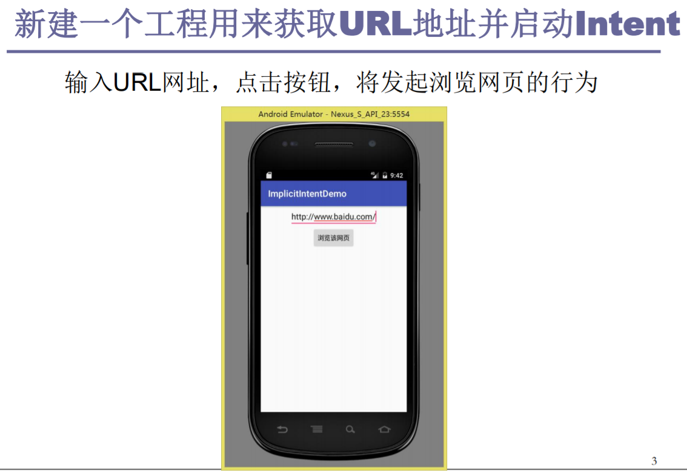
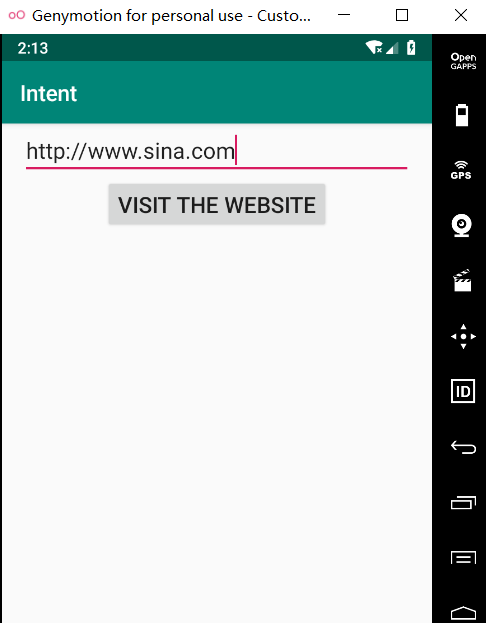
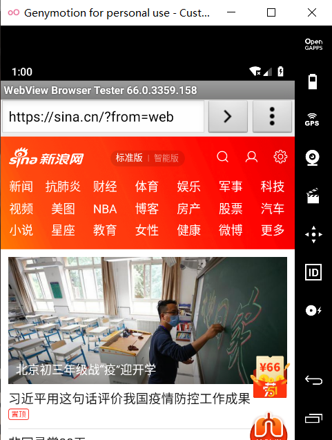
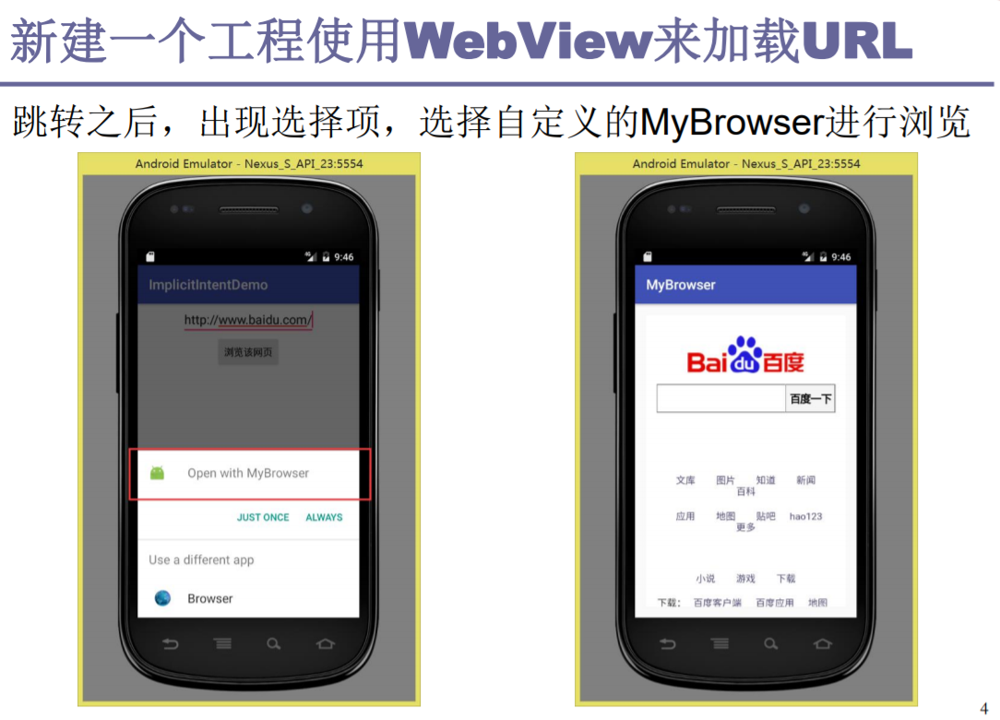
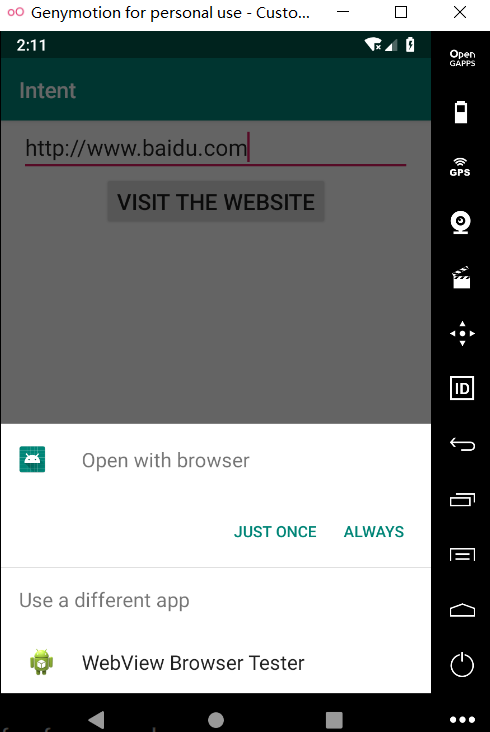
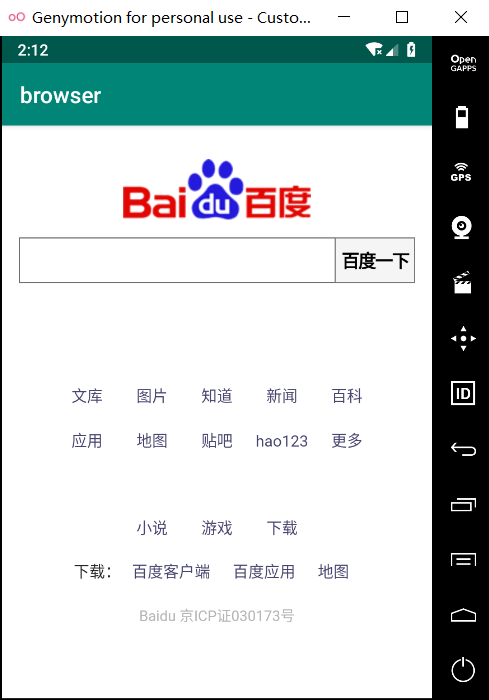

## 自定义WebView验证隐式Intent的使用

- ### 本实验通过自定义WebView加载URL来验证隐式Intent的使用。

- ### 实验包含两个应用：

#### 		◼ 第一个应用：获取URL地址并启动隐式Intent的调用。

#### 		◼ 第二个应用：自定义WebView来加载URL



##### 1.activity_main.xml

```java
<?xml version="1.0" encoding="utf-8"?>
<LinearLayout xmlns:android="http://schemas.android.com/apk/res/android"
    android:orientation="vertical"
    android:layout_width="match_parent"
    android:layout_height="match_parent"
    android:gravity="center_horizontal">

    <EditText
        android:layout_width="wrap_content"
        android:layout_height="wrap_content"
        android:id="@+id/edit"
        android:textSize="20sp"
        android:hint="@string/edit_url"
        />
    <Button
        android:layout_width="wrap_content"
        android:layout_height="wrap_content"
        android:id="@+id/btn"
        android:textSize="20sp"
        android:text="@string/btn_browse"
        />

</LinearLayout>
```


##### 2.string.xml

```java
<resources>
    <string name="app_name">IntentDemo</string>
    <string name="edit_url">Please enter the URL you want to visit.</string>
    <string name="btn_browse">Visit the website</string>
</resources>
```

##### 3.MainActivity.java

```java
import androidx.appcompat.app.AppCompatActivity;
import android.content.Intent;
import android.net.Uri;
import android.os.Bundle;
import android.view.View;
import android.widget.Button;
import android.widget.EditText;

public class MainActivity extends AppCompatActivity {
    EditText editUrl;
    Button btnBrowse;
    @Override
    protected void onCreate(Bundle savedInstanceState) {
        super.onCreate(savedInstanceState);
        setContentView(R.layout.activity_main);

        editUrl = (EditText)findViewById(R.id.edit);
        btnBrowse = (Button)findViewById(R.id.btn);
        btnBrowse.setOnClickListener(new View.OnClickListener() {
            @Override
            public void onClick(View view) {
                String url = editUrl.getText().toString();
                Intent intent = new Intent();
                intent.setAction(Intent.ACTION_VIEW);
                intent.setData(Uri.parse(url));
                startActivity(intent);
            }
        });
    }
}
```

##### 运行结果：









##### 1.activity_main.xml

```java
<?xml version="1.0" encoding="utf-8"?>
<LinearLayout xmlns:android="http://schemas.android.com/apk/res/android"
    xmlns:tools="http://schemas.android.com/tools"
    android:layout_width="match_parent"
    android:layout_height="match_parent"
    tools:context="com.example.browser.MainActivity">

    <WebView
        android:layout_width="match_parent"
        android:layout_height="match_parent"
        android:id="@+id/webView"
        >
    </WebView>
</LinearLayout>
```

##### 2.MainActivity.java

```java
import androidx.appcompat.app.AppCompatActivity;
import android.content.Intent;
import android.net.Uri;
import android.os.Bundle;
import android.webkit.WebView;
import android.webkit.WebViewClient;
import java.net.URL;
public class MainActivity extends AppCompatActivity {
    @Override
    protected void onCreate(Bundle savedInstanceState) {
        super.onCreate(savedInstanceState);
        setContentView(R.layout.activity_main);
        Intent intent = getIntent();
        Uri data = intent.getData();
        URL url = null;
        try {
            url = new URL(data.getScheme(), data.getHost(),
                    data.getPath());
        } catch (Exception e) {
            e.printStackTrace();
        }
        startBrowser(url);
    }
    private void startBrowser(URL url) {
        WebView webView = (WebView) findViewById(R.id.webView);
        //WebView加载web资源
        webView.loadUrl(url.toString());
        //覆盖WebView默认使用第三方或系统默认浏览器打开网页的行为，使网页用WebView打开
        webView.setWebViewClient(new WebViewClient(){
            @Override
            public boolean shouldOverrideUrlLoading(WebView view, String url) {
                // TODO Auto-generated method stub
                //返回值是true的时候控制去WebView打开，为false调用系统浏览器或第三方浏览器
                view.loadUrl(url);
                return true;
            }
        });
    }
}
```


##### 3..AndroidManifest.xml

```java
<?xml version="1.0" encoding="utf-8"?>
<manifest xmlns:android="http://schemas.android.com/apk/res/android"
    package="com.example.browser">

    <application
        android:allowBackup="true"
        android:icon="@mipmap/ic_launcher"
        android:label="@string/app_name"
        android:roundIcon="@mipmap/ic_launcher_round"
        android:supportsRtl="true"
        android:theme="@style/AppTheme"
        android:usesCleartextTraffic="true">
        <activity android:name=".MainActivity">
            <intent-filter>
                <action android:name="android.intent.action.VIEW" />
                <category android:name="android.intent.category.DEFAULT" />
                <data android:scheme="http" />
            </intent-filter>
        </activity>

    </application>
    <uses-permission android:name="android.permission.INTERNET" />
</manifest>
```

##### 运行结果：



