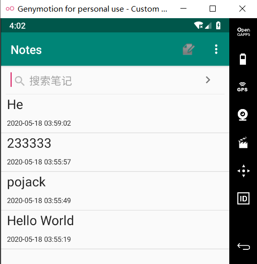
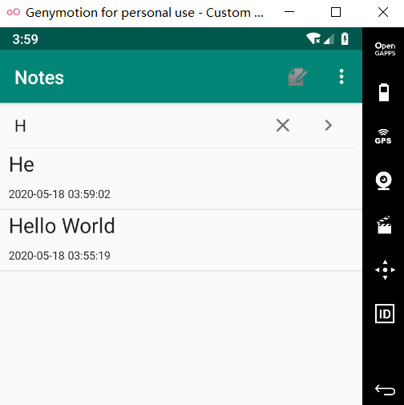
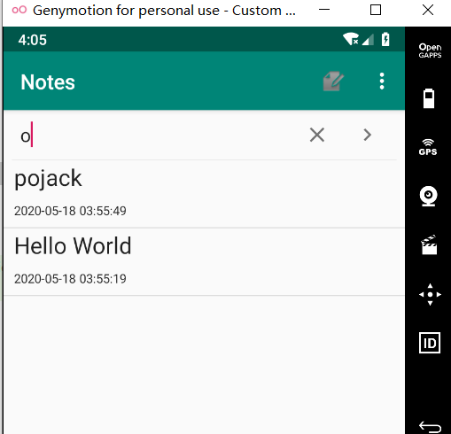

# NotePad笔记本应用

## 阅读NotePad的源代码并做如下扩展：

#### 基本要求：每个人必须完成(本年度期中作业只需完成这两项)

#### 1.NoteList中显示条目增加时间戳显示

#### 2.添加笔记查询功能（根据标题查询）


#### 1.时间戳

**(1)在布局文件中增加一个TextView来显示时间戳**

```java
<?xml version="1.0" encoding="utf-8"?>
<LinearLayout xmlns:android="http://schemas.android.com/apk/res/android"
    android:layout_width="match_parent"
    android:layout_height="?android:attr/listPreferredItemHeight"
    android:orientation="vertical">

    <TextView
        android:id="@+id/text1"
        android:layout_width="match_parent"
        android:layout_height="match_parent"
        android:textAppearance="?android:attr/textAppearanceLarge"
        android:gravity="center_vertical"
        android:paddingLeft="10dip"
        android:singleLine="true"
        android:layout_weight="1"
        android:layout_margin="0dp"
        />
    <TextView
        android:id="@+id/text2"
        android:layout_width="match_parent"
        android:layout_height="match_parent"
        android:textAppearance="?android:attr/textAppearanceLarge"
        android:textSize="12dp"
        android:gravity="center_vertical"
        android:paddingLeft="10dip"
        android:singleLine="true"
        android:layout_weight="1"
        android:layout_margin="0dp"
        />
</LinearLayout>
```

**(2)在NodeEditor.java中,找到updateNode()这个函数，选取修改时间这一字段，并将其格式化存入数据库**

```java
Date nowTime = new Date(System.currentTimeMillis());
        SimpleDateFormat sdFormatter = new SimpleDateFormat("yyyy-MM-dd HH:mm:ss");
        String retStrFormatNowDate = sdFormatter.format(nowTime);
        ContentValues values = new ContentValues();
        values.put(NotePad.Notes.COLUMN_NAME_MODIFICATION_DATE, retStrFormatNowDate);
```

**(3)在NoteList.java的PROJECTION数组中将时间投影出来，为了显示出来，需要在SimpleCursorAdapter中设置，增加dataColumns和viewIDs。**

```java
private static final String[] PROJECTION = new String[] {
            NotePad.Notes._ID, // 0
            NotePad.Notes.COLUMN_NAME_TITLE, // 1
            NotePad.Notes.COLUMN_NAME_MODIFICATION_DATE,
    };
```

```java
private String[] dataColumns = { NotePad.Notes.COLUMN_NAME_TITLE,NotePad.Notes.COLUMN_NAME_MODIFICATION_DATE} ;

private int[] viewIDs = { R.id.text1,R.id.text2 };
```

#### 运行结果



#### 2.添加笔记查询功能（根据标题查询）

**（1）在布局文件中新增SearchView控件**

```java
 <android.support.v7.widget.SearchView
        android:id="@+id/sv"
        android:layout_width="match_parent"
        android:layout_height="wrap_content"
        >
    </android.support.v7.widget.SearchView>
```

**（2）在NodeList.java中创建一个函数专门来配置SeachView，进行模糊查询，onQueryTextChange在字段有变化的时候就查询。**

```java
private void SearchView(){
        searchView=findViewById(R.id.sv);     
        searchView.onActionViewExpanded();  
        searchView.setQueryHint("搜索笔记");   
        searchView.setSubmitButtonEnabled(true);
        searchView.setOnQueryTextListener(new SearchView.OnQueryTextListener() {
            @Override
            public boolean onQueryTextSubmit(String s) {
                return false;
            }
            @Override
            public boolean onQueryTextChange(String s) {
                if(!s.equals("")){
                    String selection=NotePad.Notes.COLUMN_NAME_TITLE+" GLOB '*"+s+"*'";
                    updatecursor = getContentResolver().query(
                            getIntent().getData(),           
                            PROJECTION,                     
                            selection,                       
                            null,                           
                            NotePad.Notes.DEFAULT_SORT_ORDER 
                    );
                }
               else {
                    updatecursor = getContentResolver().query(
                            getIntent().getData(),            
                            PROJECTION,                       
                            null,                             
                            null,                       
                            NotePad.Notes.DEFAULT_SORT_ORDER  
                    );
                }
                adapter.swapCursor(updatecursor);
                return false;
            }
        });
    }
```

#### 运行结果  



