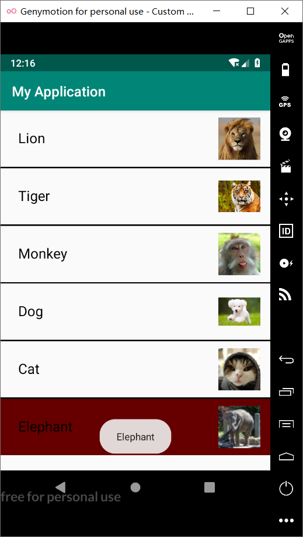

# Android ListView的用法

### 1.利用SimpleAdapter实现如下界面效果


##### （1）main.xml

```java
<?xml version="1.0" encoding="utf-8"?>
<LinearLayout xmlns:android="http://schemas.android.com/apk/res/android"
    android:layout_width="match_parent"
    android:layout_height="wrap_content"
    android:orientation="horizontal">

    <ListView
        android:id="@+id/mylist"
        android:layout_width="match_parent"
        android:layout_height="wrap_content"
        android:divider="#000"
        android:dividerHeight="2dp"
        android:listSelector="#600" />

</LinearLayout>
```

##### (2)simple.xml

```java
<?xml version="1.0" encoding="utf-8"?>
<LinearLayout xmlns:android="http://schemas.android.com/apk/res/android"
    android:layout_width="match_parent"
    android:layout_height="wrap_content"
    android:orientation="horizontal">
    <!-- 定义一个TextView -->
    <TextView
        android:id="@+id/text"
        android:layout_width="300dp"
        android:layout_height="wrap_content"
        android:padding="25dp"
        android:textSize="20sp"
        android:textColor="#000" />
    <!-- 定义一个ImageView -->
    <ImageView
        android:id="@+id/image"
        android:layout_width="80dp"
        android:layout_height="80dp"
        android:padding="10dp" />

</LinearLayout>
```

(3)MainActivity.java

```java
package com.example.myapplication;
import androidx.appcompat.app.AppCompatActivity;
import android.os.Bundle;
import android.view.View;
import android.widget.AdapterView;
import android.widget.ListView;
import android.widget.SimpleAdapter;
import android.widget.Toast;
import java.util.ArrayList;
import java.util.HashMap;
import java.util.List;
import java.util.Map;

public class MainActivity extends AppCompatActivity {
    private String[] names = new String[]{"Lion", "Tiger", "Monkey", "Dog", "Cat", "Elephant"};
    private int[] imagesIds = new int[]{R.drawable.lion, R.drawable.tiger, R.drawable.monkey, R.drawable.dog, R.drawable.cat, R.drawable.elephant};

    @Override
    protected void onCreate(Bundle savedInstanceState) {
        super.onCreate(savedInstanceState);
        setContentView(R.layout.main);
        //创建一个List集合，List集合的元素是Map
        List<Map<String, Object>> listitems = new ArrayList<Map<String, Object>>();
        for (int i = 0; i < names.length; i++) {
            Map<String, Object> listitem = new HashMap<String, Object>();
            //键值对
            listitem.put("textview", names[i]);
            listitem.put("imageview", imagesIds[i]);
            listitems.add(listitem);
        }
        //创建一个SimpleAdapter
        SimpleAdapter simpleAdapter = new SimpleAdapter(this, listitems, R.layout.simpleadapter, new String[]{"textview", "imageview"}, new int[]{R.id.text, R.id.image});
        ListView list = findViewById(R.id.mylist);
        // 为ListView设置Adapter
        list.setAdapter(simpleAdapter);
        // 为ListView的单击事件绑定事件监听器
        list.setOnItemClickListener(new AdapterView.OnItemClickListener() {
            @Override
            public void onItemClick(AdapterView<?> parent, View view, int position, long id) {
                // 创建一个Toast提示信息
                Toast toast = Toast.makeText(MainActivity.this, names[position], Toast.LENGTH_SHORT); // 设置该Toast提示信息的持续时间
                toast.show();
            }
        });
    }
}
```

##### (5)运行结果：



### 2.创建自定义布局的AlertDialog

#### ◼ 创建如图所示的自定义对话框

#### ◼ 请创建一个如图所示的布局，

#### ◼ 调用 AlertDialog.Builder 对象上的 setView() 将布局添加到

#### AlertDialog。


##### （1）main.xml

```jade
<?xml version="1.0" encoding="utf-8"?>
<LinearLayout xmlns:android="http://schemas.android.com/apk/res/android"
    android:layout_width="match_parent"
    android:layout_height="match_parent"
    android:orientation="vertical">

    <!-- 定义一个普通的按钮组件 -->
    <Button
        android:layout_width="200dp"
        android:layout_height="200dp"
        android:onClick="customView"
        android:text="@string/view"
        android:layout_marginTop="20dp"
        android:layout_marginLeft="100dp"
        android:layout_marginBottom="50dp"/>

    <!-- 显示一个普通的文本编辑框组件 -->
    <TextView
        android:id="@+id/show"
        android:layout_width="match_parent"
        android:layout_height="wrap_content"
        android:textSize="20dp"
        android:inputType="text" />

</LinearLayout>
```

##### (2)login.xml

```java
<?xml version="1.0" encoding="utf-8"?>
<LinearLayout xmlns:android="http://schemas.android.com/apk/res/android"
    android:layout_width="match_parent"
    android:layout_height="match_parent"
    android:orientation="vertical">

    <TextView
        android:layout_width="match_parent"
        android:layout_height="60dp"
        android:textSize="30sp"
        android:text="@string/android_app"
        android:gravity="center"
        android:typeface="serif"
        android:background="#FFFFBB33"
        />

    <EditText
        android:id="@+id/username"
        android:layout_width="match_parent"
        android:layout_height="wrap_content"
        android:hint="@string/username"
        android:selectAllOnFocus="true"
        android:layout_marginTop="20dp"
        android:layout_marginLeft="5dp"
        android:layout_marginRight="5dp"
        android:layout_marginBottom="5dp" />

    <EditText
        android:id="@+id/password"
        android:layout_width="match_parent"
        android:layout_height="wrap_content"
        android:hint="@string/password"
        android:inputType="textPassword"
        android:layout_marginTop="5dp"
        android:layout_marginLeft="5dp"
        android:layout_marginRight="5dp"
        android:layout_marginBottom="20dp" />

</LinearLayout>
```

##### (3)strings.xml

```java
<resources>
    <string name="app_name">My Application</string>
    <string name="android_app">ANDROID APP</string>
    <string name="password">Password</string>
    <string name="username">Username</string>
    <string name="view">自定义View对话框</string>
</resources>
```

##### (4)MainActitvity.java

```java
package com.example.myapplication;

import androidx.appcompat.app.AppCompatActivity;
import android.os.Bundle;
import android.app.AlertDialog;
import android.view.View;
import android.widget.LinearLayout;
import android.widget.TextView;

public class MainActivity extends AppCompatActivity {
    private TextView show;
    @Override
    protected void onCreate(Bundle savedInstanceState) {
        super.onCreate(savedInstanceState);
        setContentView(R.layout.main);
        show = findViewById(R.id.show);
    }
    private AlertDialog.Builder setPositiveButton(AlertDialog.Builder builder)
    {
        // 调用setPositiveButton方法添加“Sign in”按钮
        return builder.setPositiveButton("Sign in", (dialog, which) -> show.setText("Sign in ！"));
    }
    private AlertDialog.Builder setNegativeButton(AlertDialog.Builder builder)
    {
        // 调用setNegativeButton方法添加“Cancel”按钮
        return builder.setNegativeButton("Cancel", (dialog, which) -> show.setText("Cancel ！"));
    }
    public void customView(View source)
    {
        // 加载\res\layout\login.xml界面布局文件
        LinearLayout loginForm = (LinearLayout) getLayoutInflater().inflate(R.layout.login, null);
        // 设置对话框显示的View对象
        AlertDialog.Builder builder = new AlertDialog.Builder(this).setView(loginForm);
        // 为AlertDialog.Builder添加“确定”按钮
        setPositiveButton(builder);
        // 为AlertDialog.Builder添加“取消”按钮
        setNegativeButton(builder).create().show();
    }
}
```

##### (5)运行结果：


### 3.使用XML定义菜单

##### ◼ 字体大小（有小，中，大这3个选项；分

##### 别对应10号字，16号字和20号字）；

##### 点击之后设置测试文本的字体

##### ◼ 普通菜单项，点击之后弹出Toast提示

##### ◼ 字体颜色（有红色和黑色这2个选项），

##### 点击之后设置测试文本的字体


##### (1)main.xml

```java
<?xml version="1.0" encoding="utf-8"?>
<LinearLayout xmlns:android="http://schemas.android.com/apk/res/android"
    android:layout_width="match_parent"
    android:layout_height="match_parent"
    android:orientation="vertical">

    <TextView
        android:id="@+id/txt"
        android:padding="15dp"
        android:layout_width="match_parent"
        android:layout_height="wrap_content"
        android:textSize="30sp"
        android:text="用于测试的内容" />

</LinearLayout>
```

##### （2）MainActicity.java

```java
import androidx.appcompat.app.AppCompatActivity;
import android.os.Bundle;
import android.widget.TextView;
import android.graphics.Color;
import android.view.Menu;
import android.view.MenuItem;
import android.view.SubMenu;
import android.widget.Toast;

public class MainActivity extends AppCompatActivity {
    // 定义“字体大小”菜单项的标识
    private static final int FONT_10 = 0x111;
    private static final int FONT_16 = 0x112;
    private static final int FONT_20 = 0x113;
    // 定义“普通菜单项”的标识
    private static final int PLAIN_ITEM = 0x11b;
    // 定义“字体颜色”菜单项的标识
    private static final int FONT_RED = 0x114;
    private static final int FONT_BLACK = 0x115;
    private TextView text;
    @Override
    protected void onCreate(Bundle savedInstanceState) {
        super.onCreate(savedInstanceState);
        setContentView(R.layout.main);
        text = findViewById(R.id.txt);
    }
    // 当用户单击MENU键时触发该方法
    @Override 
    public boolean onCreateOptionsMenu(Menu menu)
    {
        // -------------向menu中添加“字体大小”的子菜单-------------
        SubMenu fontMenu = menu.addSubMenu("字体大小");
        // 设置菜单头的标题
        fontMenu.setHeaderTitle("选择字体大小");
        fontMenu.add(0, FONT_10, 0, "10号字体");
        fontMenu.add(0, FONT_16, 0, "16号字体");
        fontMenu.add(0, FONT_20, 0, "20号字体");
        // -------------向menu中添加“普通菜单项”-------------
        menu.add(0, PLAIN_ITEM, 0, "普通菜单项");
        // -------------向menu中添加“字体颜色”的子菜单-------------
        SubMenu colorMenu = menu.addSubMenu("字体颜色");
        // 设置菜单头的标题
        colorMenu.setHeaderTitle("选择文字颜色");
        colorMenu.add(0, FONT_RED, 0, "红色");
        colorMenu.add(0, FONT_BLACK, 0, "黑色");
        return super.onCreateOptionsMenu(menu);
    }
    // 选项菜单的菜单项被单击后的回调方法
    @Override 
    public boolean onOptionsItemSelected(MenuItem mi)
    {
        // 判断单击的是哪个菜单项，并有针对性地做出响应
        switch (mi.getItemId())
        {
            case FONT_10: text.setTextSize(10 * 2);	break;
            case FONT_16: text.setTextSize(16 * 2); break;
            case FONT_20: text.setTextSize(20 * 2); break;
            case FONT_RED: text.setTextColor(Color.RED); break;
            case FONT_BLACK: text.setTextColor(Color.BLACK); break;
            case PLAIN_ITEM:
                Toast.makeText(MainActivity.this,
                        "您单击了普通菜单项", Toast.LENGTH_SHORT)
                        .show();
                break;
        }
        return true;
    }
}
```

##### (3)运行结果


### 4.创建上下文操作模式(ActionMode)的上下文菜单

#### 创建如图模式的上下文菜单

#### ◼ 使用ListView或者ListActivity创建

#### List

#### ◼ 为List Item创建ActionMode形式

#### 的上下文菜单


##### （1）activity_main.xml

```java
<?xml version="1.0" encoding="utf-8"?>
<LinearLayout
    xmlns:android="http://schemas.android.com/apk/res/android"
    android:layout_width="match_parent"
    android:layout_height="wrap_content">
    <ImageView
        android:id="@+id/image"
        android:layout_width="50dp"
        android:layout_height="50dp"
        android:layout_margin="5dp"
        android:src="@drawable/robot" />

    <TextView
        android:id="@+id/text_view"
        android:layout_width="match_parent"
        android:layout_height="60dp"
        android:gravity="center_vertical" />

</LinearLayout>
```

##### (2)activity_content.xml

```java
<LinearLayout
    xmlns:android="http://schemas.android.com/apk/res/android"
    android:layout_width="match_parent"
    android:layout_height="wrap_content">
    <ImageView
        android:id="@+id/image"
        android:layout_width="50dp"
        android:layout_height="50dp"
        android:layout_margin="5dp"
        android:src="@drawable/robot" />

    <TextView
        android:id="@+id/text_view"
        android:layout_width="match_parent"
        android:layout_height="60dp"
        android:gravity="center_vertical" />

</LinearLayout>
```

##### (3)action_mode.xml

```java
<?xml version="1.0" encoding="utf-8"?>
<menu xmlns:android="http://schemas.android.com/apk/res/android"
    xmlns:app="http://schemas.android.com/apk/res-auto">

    <item
        android:id="@+id/menu_all"
        app:showAsAction="always"
        android:icon="@drawable/select"
        android:title="item_all"/>

    <item
        android:id="@+id/menu_delete"
        app:showAsAction="always"
        android:icon="@drawable/dustbin"
        android:title="item_delete"/>
</menu>
```

##### (4)MainActivity.java

```java
package com.example.myapplication;

import androidx.appcompat.app.AppCompatActivity;
import android.os.Bundle;
import android.view.ActionMode;
import android.view.Menu;
import android.view.MenuInflater;
import android.view.MenuItem;
import android.widget.AbsListView;
import android.widget.BaseAdapter;
import android.widget.ListView;
import java.util.ArrayList;
import java.util.List;

public class MainActivity extends AppCompatActivity {

    private ListView listView;
    private List<Item> list;

    private BaseAdapter adapter;
    private String [] name = {"One","Two","Three","Four","Five","Six"};

    @Override
    protected void onCreate(Bundle savedInstanceState) {
        super.onCreate(savedInstanceState);
        setContentView(R.layout.activity_main);

        listView = findViewById(R.id.list_view);
        list = new ArrayList<Item>();
        for(int i = 0; i < 6; i++){
            list.add(new Item(name[i], false));
        }
        adapter = new AdapterCur(list,MainActivity.this);
        listView.setAdapter(adapter);

        listView.setChoiceMode(ListView.CHOICE_MODE_MULTIPLE_MODAL);
        listView.setMultiChoiceModeListener(new AbsListView.MultiChoiceModeListener() {
            int num = 0;

            @Override
            public void onItemCheckedStateChanged(ActionMode mode, int position, long id, boolean checked) {

                if (checked == true) {
                    list.get(position).setBo(true);
                    adapter.notifyDataSetChanged();
                    num++;
                } else {
                    list.get(position).setBo(false);
                    adapter.notifyDataSetChanged();
                    num--;
                }
                mode.setTitle("  " + num + " Selected");
            }

            @Override
            public boolean onCreateActionMode(ActionMode mode, Menu menu) {
                MenuInflater inflater = mode.getMenuInflater();
                inflater.inflate(R.menu.activity_action_mode, menu);
                num = 0;
                adapter.notifyDataSetChanged();
                return true;
            }

            @Override
            public boolean onPrepareActionMode(ActionMode mode, Menu menu) {

                adapter.notifyDataSetChanged();
                return false;
            }

            public void refresh(){
                for(int i = 0; i < 6; i++){
                    list.get(i).setBo(false);
                }
            }

            @Override
            public boolean onActionItemClicked(ActionMode mode, MenuItem item) {
                switch (item.getItemId()) {
                    case R.id.menu_all:
                        num = 0;
                        refresh();
                        adapter.notifyDataSetChanged();
                        mode.finish();
                        return true;
                    case R.id.menu_delete:
                        adapter.notifyDataSetChanged();
                        num = 0;
                        refresh();
                        mode.finish();
                        return true;
                    default:
                        refresh();
                        adapter.notifyDataSetChanged();
                        num = 0;
                        return false;
                }

            }

            @Override
            public void onDestroyActionMode(ActionMode mode) {
                refresh();
                adapter.notifyDataSetChanged();
            }

        });
    }
}
```

##### (5)Item.java

```java
package com.example.myapplication;
public class Item {
    private String name;
    private boolean bo;

    public Item(String name, boolean bo){
        super();
        this.name = name;
        this.bo = bo;
    }
    public String getName() {
        return name;
    }

    public boolean isBo() {
        return bo;
    }
    public void setBo(boolean bo) {
        this.bo = bo;
    }
    @Override
    public String toString() {
        return "Item{" + "name='" + name + '\'' + ",bo=" + bo + '}';
    }
}
```

##### (6)AdapterCur.java

```java
package com.example.myapplication;

import android.content.Context;
import android.graphics.Color;
import android.view.View;
import android.view.ViewGroup;
import android.widget.BaseAdapter;
import android.widget.ImageView;
import android.widget.TextView;
import java.util.List;
public class AdapterCur extends BaseAdapter {

    List<Item> list;
    Context context;

    public AdapterCur(List<Item> list, Context context) {
        this.context = context;
        this.list = list;
        notifyDataSetChanged();
    }

    public int getCount() {
        return list.size();
    }

    public Item getItem(int position) {
        return list.get(position);
    }

    public long getItemId(int position) {
        return 0;
    }

    public View getView(final int position, View convertView, ViewGroup parent) {

        final ViewHolder viewHolder;
        if(convertView==null){
            convertView=View.inflate(context, R.layout.activity_content, null);
            viewHolder=new ViewHolder();
            viewHolder.imageView = convertView.findViewById(R.id.image);
            viewHolder.textView = convertView.findViewById(R.id.text_view);
            convertView.setTag(viewHolder);
        }else{
            viewHolder=(ViewHolder) convertView.getTag();
        }

        int PaleTurquoise = Color.parseColor("#AFEEEE");
        int white = Color.parseColor("#FFFFFF");
        viewHolder.textView.setText(list.get(position).getName());
        if(list.get(position).isBo() == true){
            viewHolder.textView.setBackgroundColor(PaleTurquoise);
            viewHolder.imageView.setBackgroundColor(PaleTurquoise);
        }
        else {
            viewHolder.textView.setBackgroundColor(white);
            viewHolder.imageView.setBackgroundColor(white);
        }
        return convertView;
    }
    class ViewHolder{
        ImageView imageView;
        TextView textView;
    }
}

```

##### (7)运行结果

