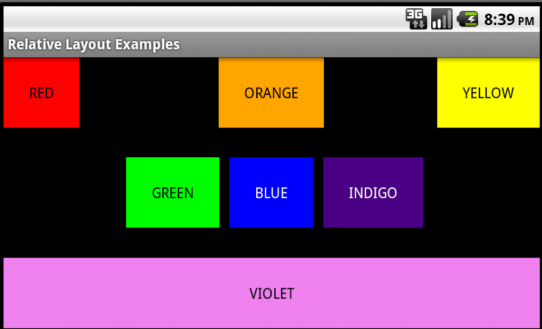
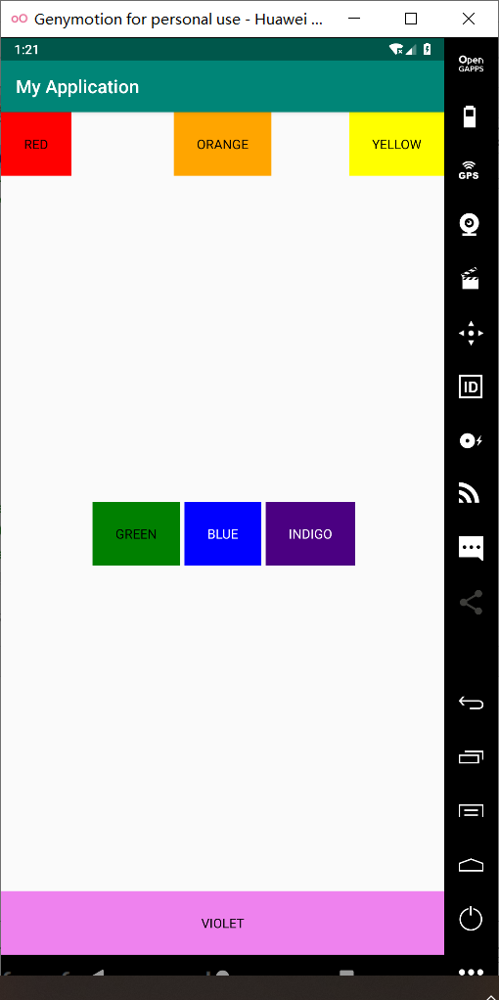

# Android布局实验

## 利用ConstraintLayout实现如下界面：



#### （1）activity_main.xml

```java
<?xml version="1.0" encoding="utf-8"?>
<androidx.constraintlayout.widget.ConstraintLayout xmlns:android="http://schemas.android.com/apk/res/android"
    xmlns:app="http://schemas.android.com/apk/res-auto"
    xmlns:tools="http://schemas.android.com/tools"
    android:layout_width="match_parent"
    android:layout_height="match_parent"
    tools:context=".MainActivity">

    <TextView
        android:id="@+id/Blue"
        android:layout_width="wrap_content"
        android:layout_height="wrap_content"
        android:padding="25dp"
        android:text="BLUE"
        android:background="@color/blue"
        android:textColor="@color/white"
        app:layout_constraintBottom_toBottomOf="parent"
        app:layout_constraintLeft_toLeftOf="parent"
        app:layout_constraintRight_toRightOf="parent"
        app:layout_constraintTop_toTopOf="parent" />

    <TextView
        android:id="@+id/Green"
        android:layout_margin="5dp"
        android:padding="25dp"
        android:layout_width="wrap_content"
        android:layout_height="wrap_content"
        android:text="GREEN"
        android:background="@color/green"
        android:textColor="@color/black"
        tools:ignore="MissingConstraints"
        app:layout_constraintTop_toTopOf="parent"
        app:layout_constraintBottom_toBottomOf="parent"
        app:layout_constraintRight_toLeftOf="@+id/Blue"/>

    <TextView
        android:id="@+id/Indigo"
        android:layout_margin="5dp"
        android:padding="25dp"
        android:layout_width="wrap_content"
        android:layout_height="wrap_content"
        android:text="INDIGO"
        android:background="@color/indigo"
        android:textColor="@color/white"
        tools:ignore="MissingConstraints"
        app:layout_constraintTop_toTopOf="parent"
        app:layout_constraintBottom_toBottomOf="parent"
        app:layout_constraintLeft_toRightOf="@+id/Blue"/>


    <TextView
        android:id="@+id/Violet"
        android:padding="25dp"
        android:layout_width="match_parent"
        android:layout_height="wrap_content"
        android:text="VIOLET"
        android:background="@color/violet"
        android:textColor="@color/black"
        tools:ignore="MissingConstraints"
        android:gravity="center"
        app:layout_constraintLeft_toLeftOf="parent"
        app:layout_constraintRight_toRightOf="parent"
        app:layout_constraintBottom_toBottomOf="parent"/>

    <TextView
        android:id="@+id/Orange"
        android:padding="25dp"
        android:layout_width="wrap_content"
        android:layout_height="wrap_content"
        android:text="ORANGE"
        android:background="@color/orange"
        android:textColor="@color/black"
        tools:ignore="MissingConstraints"
        android:gravity="center"
        app:layout_constraintLeft_toLeftOf="parent"
        app:layout_constraintRight_toRightOf="parent"
        app:layout_constraintTop_toTopOf="parent"/>

    <TextView
        android:id="@+id/Red"
        android:padding="25dp"
        android:layout_width="wrap_content"
        android:layout_height="wrap_content"
        android:text="RED"
        android:background="@color/red"
        android:textColor="@color/black"
        tools:ignore="MissingConstraints"
        android:gravity="center"
        app:layout_constraintLeft_toLeftOf="parent"
        app:layout_constraintTop_toTopOf="parent"/>

    <TextView
        android:id="@+id/Yellow"
        android:padding="25dp"
        android:layout_width="wrap_content"
        android:layout_height="wrap_content"
        android:text="YELLOW"
        android:background="@color/yellow"
        android:textColor="@color/black"
        tools:ignore="MissingConstraints"
        android:gravity="center"
        app:layout_constraintRight_toRightOf="parent"
        app:layout_constraintTop_toTopOf="parent"/>

</androidx.constraintlayout.widget.ConstraintLayout>

```


#### （2）MainActivity.java

```java
  
package com.example.constraintlayout;

import androidx.appcompat.app.AppCompatActivity;

import android.os.Bundle;

public class MainActivity extends AppCompatActivity {

    @Override
    protected void onCreate(Bundle savedInstanceState) {
        super.onCreate(savedInstanceState);
        setContentView(R.layout.activity_main);
    }
}
```


#### （3）colors.xml

```java
<?xml version="1.0" encoding="utf-8"?>
<resources>
    <color name="colorPrimary">#008577</color>
    <color name="colorPrimaryDark">#00574B</color>
    <color name="colorAccent">#D81B60</color>
    <color name="blue">#0000FF</color><!--蓝色 -->
    <color name="red">#FF0000</color><!--红色 -->
    <color name="orange">#FFA500</color><!--橙色 -->
    <color name="yellow">#FFFF00</color><!--黄色 -->
    <color name="green">#008000</color><!--绿色 -->
    <color name="indigo">#4B0082</color><!--靛青色 -->
    <color name="violet">#EE82EE</color><!--紫罗兰色 -->
    <color name="white">#FFFFFF</color><!--白色 -->
    <color name="black">#000000</color><!--黑色 -->
</resources>

```

#### 运行结果

