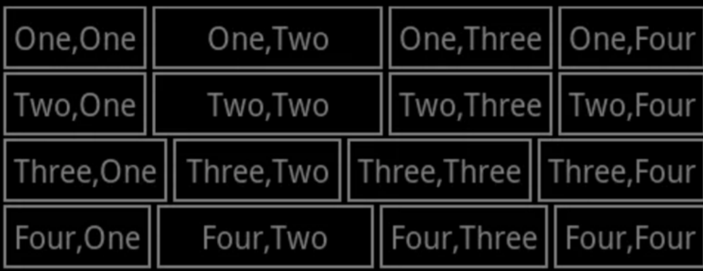
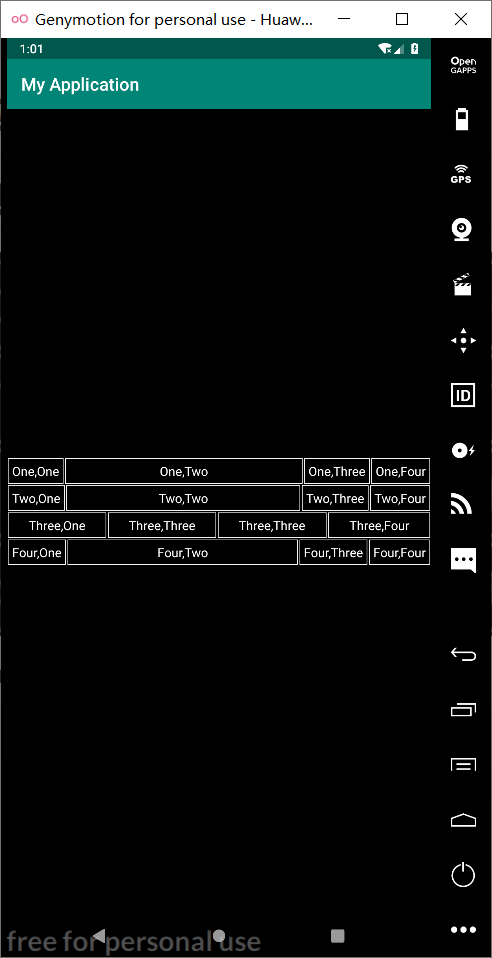

# Android布局实验

## 1.利用线性布局实现如下界面：



#### （1）编写activity_main.xml

```
<?xml version="1.0" encoding="utf-8"?>
<LinearLayout xmlns:android="http://schemas.android.com/apk/res/android"
    android:layout_width="match_parent"
    android:layout_height="match_parent"
    android:background="@color/black"
    android:gravity="center"
    android:orientation="vertical">

    <LinearLayout
        android:layout_width="match_parent"
        android:layout_height="wrap_content">
        <TextView
            android:layout_width="wrap_content"
            android:layout_height="wrap_content"
            android:layout_margin="1dp"
            android:padding="5dp"
            android:background="@drawable/textview_border"
            android:text="One,One"
            android:textColor="@color/white"/>

        <TextView
            android:layout_width="0dp"
            android:layout_margin="1dp"
            android:padding="5dp"
            android:layout_weight="1"
            android:layout_height="wrap_content"
            android:background="@drawable/textview_border"
            android:text="One,Two"
            android:gravity="center"
            android:textColor="@color/white"/>
        <TextView
            android:layout_margin="1dp"
            android:padding="5dp"
            android:layout_width="wrap_content"
            android:layout_height="wrap_content"
            android:background="@drawable/textview_border"
            android:text="One,Three"
            android:textColor="@color/white"/>

        <TextView
            android:layout_margin="1dp"
            android:padding="5dp"
            android:layout_width="wrap_content"
            android:layout_height="wrap_content"
            android:background="@drawable/textview_border"
            android:text="One,Four"
            android:textColor="@color/white"/>
    </LinearLayout>

    <LinearLayout
        android:layout_width="match_parent"
        android:layout_height="wrap_content">
        <TextView
            android:layout_width="wrap_content"
            android:layout_height="wrap_content"
            android:layout_margin="1dp"
            android:padding="5dp"
            android:background="@drawable/textview_border"
            android:text="Two,One"
            android:textColor="@color/white"/>

        <TextView
            android:layout_width="0dp"
            android:layout_margin="1dp"
            android:padding="5dp"
            android:layout_weight="1"
            android:layout_height="wrap_content"
            android:background="@drawable/textview_border"
            android:text="Two,Two"
            android:gravity="center"
            android:textColor="@color/white"/>
        <TextView
            android:layout_margin="1dp"
            android:padding="5dp"
            android:layout_width="wrap_content"
            android:layout_height="wrap_content"
            android:background="@drawable/textview_border"
            android:text="Two,Three"
            android:textColor="@color/white"/>

        <TextView
            android:layout_margin="1dp"
            android:padding="5dp"
            android:layout_width="wrap_content"
            android:layout_height="wrap_content"
            android:background="@drawable/textview_border"
            android:text="Two,Four"
            android:textColor="@color/white"/>
    </LinearLayout>
    <LinearLayout
        android:layout_width="match_parent"
        android:layout_height="wrap_content">
        <TextView
            android:layout_width="wrap_content"
            android:layout_height="wrap_content"
            android:layout_weight="1"
            android:layout_margin="1dp"
            android:padding="5dp"
            android:gravity="center"
            android:background="@drawable/textview_border"
            android:text="Three,One"
            android:textColor="@color/white"/>
        <TextView
            android:gravity="center"
            android:layout_margin="1dp"
            android:layout_weight="1"
            android:padding="5dp"
            android:layout_width="wrap_content"
            android:layout_height="wrap_content"
            android:background="@drawable/textview_border"
            android:text="Three,Three"
            android:textColor="@color/white"/>
        <TextView
            android:gravity="center"
            android:layout_margin="1dp"
            android:layout_weight="1"
            android:padding="5dp"
            android:layout_width="wrap_content"
            android:layout_height="wrap_content"
            android:background="@drawable/textview_border"
            android:text="Three,Three"
            android:textColor="@color/white"/>

        <TextView
            android:gravity="center"
            android:layout_margin="1dp"
            android:layout_weight="1"
            android:padding="5dp"
            android:layout_width="wrap_content"
            android:layout_height="wrap_content"
            android:background="@drawable/textview_border"
            android:text="Three,Four"
            android:textColor="@color/white"/>
    </LinearLayout>

    <LinearLayout
        android:layout_width="match_parent"
        android:layout_height="wrap_content">
        <TextView
            android:layout_width="wrap_content"
            android:layout_height="wrap_content"
            android:layout_margin="1dp"
            android:padding="5dp"
            android:background="@drawable/textview_border"
            android:text="Four,One"
            android:textColor="@color/white"/>

        <TextView
            android:layout_width="0dp"
            android:layout_margin="1dp"
            android:padding="5dp"
            android:layout_weight="1"
            android:layout_height="wrap_content"
            android:background="@drawable/textview_border"
            android:text="Four,Two"
            android:gravity="center"
            android:textColor="@color/white"/>
        <TextView
            android:layout_margin="1dp"
            android:padding="5dp"
            android:layout_width="wrap_content"
            android:layout_height="wrap_content"
            android:background="@drawable/textview_border"
            android:text="Four,Three"
            android:textColor="@color/white"/>

        <TextView
            android:layout_margin="1dp"
            android:padding="5dp"
            android:layout_width="wrap_content"
            android:layout_height="wrap_content"
            android:background="@drawable/textview_border"
            android:text="Four,Four"
            android:textColor="@color/white"/>
    </LinearLayout>
</LinearLayout>
```

#### （2）MainActivity.java

```java
package com.example.myapplication;
import androidx.appcompat.app.AppCompatActivity;
import android.os.Bundle;
public class MainActivity extends AppCompatActivity
{    
@Override
     protected void onCreate(Bundle savedInstanceState) {     
     super.onCreate(savedInstanceState);     
     setContentView(R.layout.activity_main);  
     }
}
```

#### （3）colors.xml

```java
<?xml version="1.0" encoding="utf-8"?>
<resources>
    <color name="colorPrimary">#008577</color>
    <color name="colorPrimaryDark">#00574B</color>
    <color name="colorAccent">#D81B60</color>
    <color name="white">#FFFFFF</color><!--白色 -->
    <color name="black">#000000</color><!--黑色 -->
</resources>
```


#### （3）textview_border.xml

```java
<?xml version="1.0" encoding="utf-8"?>
<shape xmlns:android="http://schemas.android.com/apk/res/android" android:shape="rectangle" >
    <solid android:color="@color/black" />
    <stroke android:width="1dip" android:color="#F5F5F5"/>
</shape>
```


