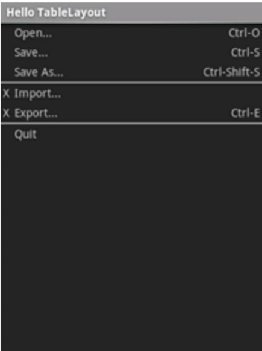
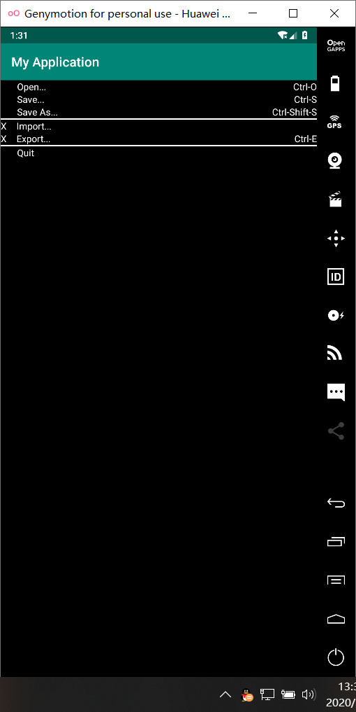

# Android布局实验

## 利用表格布局实现如下界面：




#### （1）activity_main.xml

```java
<?xml version="1.0" encoding="utf-8"?>
<LinearLayout xmlns:android="http://schemas.android.com/apk/res/android"
    xmlns:tools="http://schemas.android.com/tools"
    android:layout_width="match_parent"
    xmlns:app="http://schemas.android.com/apk/res-auto"
    android:layout_height="match_parent"
    android:background="@color/black"
    android:orientation="vertical">

    <TableLayout
        android:layout_width="match_parent"
        android:layout_height="wrap_content">
        <TableRow>
            <TextView
                android:layout_weight="1"
                android:paddingLeft="25dp"
                android:background="@color/black"
                android:textColor="@color/white"
                android:text="Open..." />

            <TextView
                android:textColor="@color/white"
                android:gravity="right"
                android:text="Ctrl-O"
                />
        </TableRow>
        <TableRow>
            <TextView
                android:layout_weight="1"
                android:paddingLeft="25dp"
                android:background="@color/black"
                android:textColor="@color/white"
                android:text="Save..." />

            <TextView
                android:textColor="@color/white"
                android:gravity="right"
                android:text="Ctrl-S"
                />
        </TableRow>
        <TableRow>
            <TextView
                android:layout_weight="1"
                android:paddingLeft="25dp"
                android:background="@color/black"
                android:textColor="@color/white"
                android:text="Save As..." />

            <TextView
                android:textColor="@color/white"
                android:gravity="right"
                android:text="Ctrl-Shift-S"
                />
        </TableRow>
        <View
            android:layout_height="2dp"
            android:background="@color/white" />
    </TableLayout>
    <TableLayout
        android:layout_width="match_parent"
        android:layout_height="wrap_content">
        <TableRow>
            <TextView
                android:textColor="@color/white"
                android:gravity="left"
                android:text="X"
                />
            <TextView
                android:layout_weight="1"
                android:paddingLeft="15dp"
                android:background="@color/black"
                android:textColor="@color/white"
                android:text="Import..." />
        </TableRow>
        <TableRow>
            <TextView
                android:textColor="@color/white"
                android:gravity="left"
                android:text="X"
                />
            <TextView
                android:layout_weight="1"
                android:paddingLeft="15dp"
                android:background="@color/black"
                android:textColor="@color/white"
                android:text="Export..." />

            <TextView
                android:textColor="@color/white"
                android:gravity="right"
                android:text="Ctrl-E"
                />
        </TableRow>
        <View
            android:layout_height="2dp"
            android:background="@color/white" />
    </TableLayout>
    <TableLayout
        android:layout_width="match_parent"
        android:layout_height="wrap_content">
        <TableRow>
            <TextView
                android:layout_weight="1"
                android:paddingLeft="25dp"
                android:background="@color/black"
                android:textColor="@color/white"
                android:text="Quit" />
        </TableRow>
    </TableLayout>

</LinearLayout>

```

#### （2）MainActivity.java

```java
package com.example.myapplication;

import androidx.appcompat.app.AppCompatActivity;

import android.os.Bundle;

public class MainActivity extends AppCompatActivity {

    @Override
    protected void onCreate(Bundle savedInstanceState) {
        super.onCreate(savedInstanceState);
        setContentView(R.layout.activity_main);
    }
}

```

#### （3）colors.xml

```java
<?xml version="1.0" encoding="utf-8"?>
<resources>
    <color name="colorPrimary">#008577</color>
    <color name="colorPrimaryDark">#00574B</color>
    <color name="colorAccent">#D81B60</color>
    <color name="white">#FFFFFF</color><!--白色 -->
    <color name="black">#000000</color><!--黑色 -->
</resources>
```

