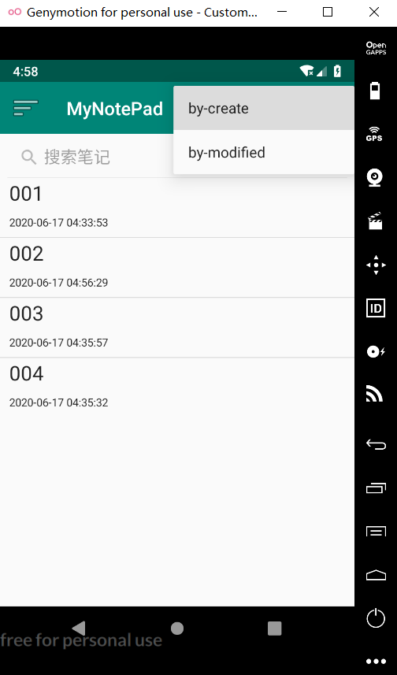
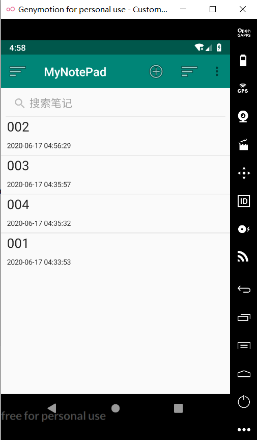

## 笔记排序功能——116072017001何俊杰

#### 1.在 list_option_menu.xml中添加:

```java
<item
        android:id="@+id/menu_sort"
        android:title="@string/menu_sort"
        android:icon="@android:drawable/ic_menu_sort_by_size"
        app:showAsAction="always" >
        <menu>
            <item
                android:id="@+id/menu_sort1"
                android:title="@string/menu_sort1"/>
            <item
                android:id="@+id/menu_sort2"
                android:title="@string/menu_sort2"/>

        </menu>
    </item>
```

#### 2.string.xml:

```
    <string name="menu_sort1">by-create</string>
    <string name="menu_sort2">by-modified</string>
```

#### 3.创建MyCursorAdapter类继承SimpleCursorAdapter

```java
package com.example.mynotepad;

import android.content.Context;
import android.database.Cursor;
import android.widget.SimpleCursorAdapter;

public class MyCursorAdapter extends SimpleCursorAdapter {

    public MyCursorAdapter(Context context, int layout, Cursor c,
                           String[] from, int[] to) {
        super(context, layout, c, from, to);
    }
}
```

#### 4.在NoteList.java中增加两个排序选项

```java
case R.id.menu_sort1:
                cursor = managedQuery(
                        getIntent().getData(),
                        PROJECTION,
                        null,
                        null,
                        NotePad.Notes._ID
                );
                adapter = new MyCursorAdapter(
                        this,
                        R.layout.noteslist_item,
                        cursor,
                        dataColumns,
                        viewIDs
                );
                listView.setAdapter(adapter);

                return true;

            case R.id.menu_sort2:
                cursor = managedQuery(
                        getIntent().getData(),
                        PROJECTION,
                        null,
                        null,
                        NotePad.Notes.DEFAULT_SORT_ORDER
                );
                adapter = new MyCursorAdapter(
                        this,
                        R.layout.noteslist_item,
                        cursor,
                        dataColumns,
                        viewIDs
                );
                listView.setAdapter(adapter);
                return true;
```

#### 5.运行结果:

##### (1)按笔记创建时间排序：



##### (2)按笔记修改时间排序：

